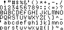
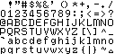
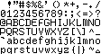
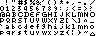
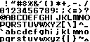
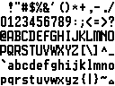

# MEG Font Family

* The MEG font family is a bitmap font family designed for use with MEG-OS.
* MEG フォントファミリーは MEG-OS で使うことを目的としてデザインされたビットマップフォントシリーズです。
* Original: https://github.com/meg-os/font-megos

## MEG Little Messenger

| Name                                                                                                                   | Size | Preview                        |
| ---------------------------------------------------------------------------------------------------------------------- | ---- | ------------------------------ |
| [MEGMsgr](https://nerry.jp/fedit95/#https://raw.githubusercontent.com/meg-os/font-megos/master/fontx2/megmsgr.fnt) | 8x10 |  |

* MEG Little Messenger (C) 2002 MEG-OS Project
* すべての MEG フォントファミリーのもとになったフォントです。本来はプロポーショナルフォントです。

## MEG Little Terminal

| Name                                                                                                                     | Size | Preview                         |
| ------------------------------------------------------------------------------------------------------------------------ | ---- | ------------------------------- |
| [MEGH0816](https://nerry.jp/fedit95/#https://raw.githubusercontent.com/meg-os/font-megos/master/fontx2/megh0816.fnt) | 8x16 |  |
| [MEGH0810](https://nerry.jp/fedit95/#https://raw.githubusercontent.com/meg-os/font-megos/master/fontx2/megh0810.fnt) | 8x10 |  |
| [MEGH0710](https://nerry.jp/fedit95/#https://raw.githubusercontent.com/meg-os/font-megos/master/fontx2/megh0710.fnt) | 7x10 |  |
| [MEGH0608](https://nerry.jp/fedit95/#https://raw.githubusercontent.com/meg-os/font-megos/master/fontx2/megh0608.fnt) | 6x8  |  |
| [MEGH0606](https://nerry.jp/fedit95/#https://raw.githubusercontent.com/meg-os/font-megos/master/fontx2/megh0606.fnt) | 6x6  |  |

* MEG Little Terminal (C) 2002, 2019 MEG-OS Project
* ターミナル用の固定幅ファミリー、バリエーションが多めです。

## MEG Little Brave

| Name                                                                                                                     | Size | Preview                         |
| ------------------------------------------------------------------------------------------------------------------------ | ---- | ------------------------------- |
| [MEGBrave](https://nerry.jp/fedit95/#https://raw.githubusercontent.com/meg-os/font-megos/master/fontx2/megbrave.fnt) | 8x10 |  |

* MEG Little Brave (C) 2002 MEG-OS Project
* 他のフォントとすこし異色なファミリーです。

## moe (Untitled)

| Name                                                                                                                     | Size | Preview                         |
| ------------------------------------------------------------------------------------------------------------------------ | ---- | ------------------------------- |
| [MOESYS16](https://nerry.jp/fedit95/#https://raw.githubusercontent.com/meg-os/font-megos/master/fontx2/moesys16.fnt) | 8x16 |  |

* (C) 2018 MEG-OS project
* いままでの MEG フォントファミリーでは解像度の高いディスプレイで読みづらかったので追加されたフォントセットです。
